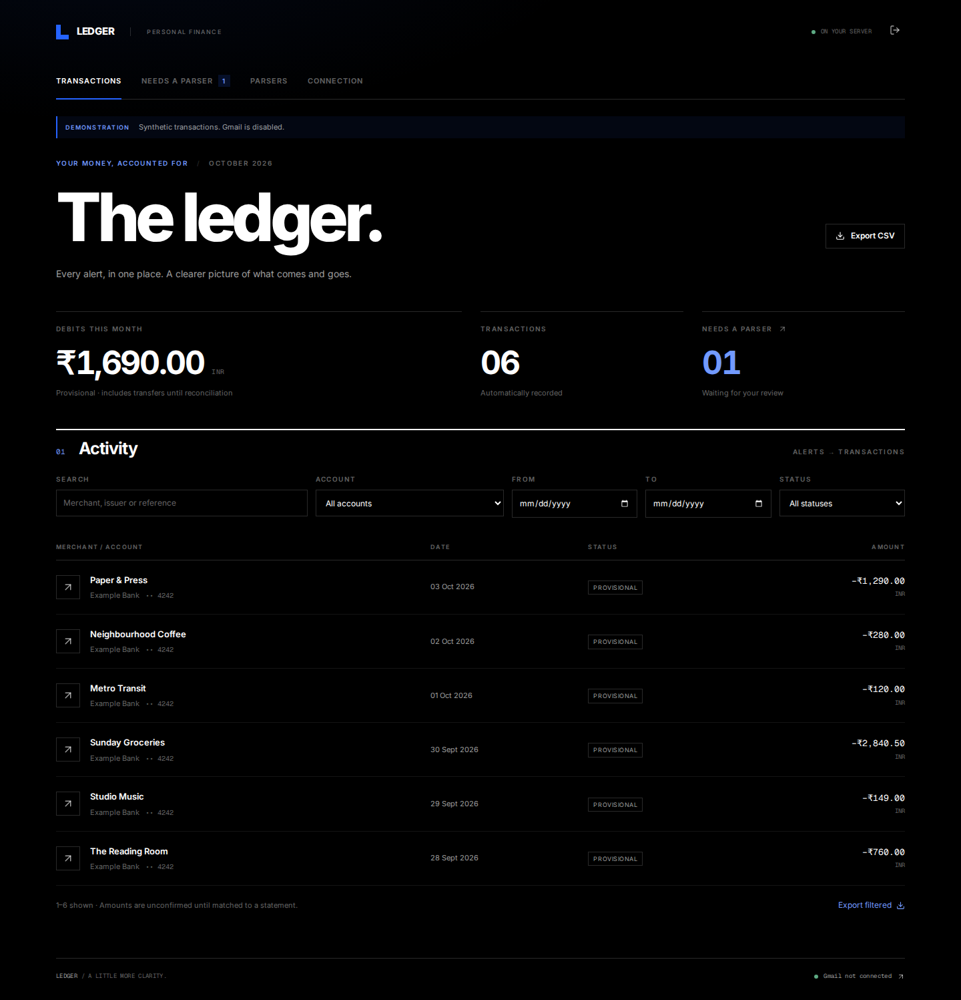

# Ledger

A private finance ledger that fills itself from the bank and card emails
already landing in Gmail. Per-transaction alerts become transactions as they
arrive; PDF statements are checked line by line and confirm them. Nothing
leaves your server: no cloud parsing, no analytics, no external fonts. A Go
binary that idles at about 11 MB of RAM.



- **Gmail, read-only**: polls one label over IMAP with an app password. It
  never moves, deletes or marks mail read. Every email is archived intact,
  attachments included, before anything else happens, and each is processed
  once however often it's fetched.
- **Alert parsers**: one per alert format. Open an email from your inbox,
  select the amount, merchant, card and date, and Ledger writes the pattern
  and date format, with a live preview. Saving one retries the whole
  backlog. Exportable as YAML.
- **PDF statements**: decrypted with passwords from the environment,
  extracted with `pdftotext`, and parsed by an issuer-specific layout. Rows
  must add up to the statement's summary before anything can be imported.
  Import the first one by hand; later ones import themselves. Supported
  today: HDFC credit cards.
- **Reconciliation**: a statement line confirms the alert for it, lines
  with no alert are added, and alerts missing from the statement are
  flagged.
- **Nothing lost**: mail no parser understands waits in the inbox with the
  reason, and so do statements that don't validate.
- **Transactions**: filter by account, status and date, search, export CSV.
  Money is kept in integer paise, per currency.
- **Foyer**: a widget with this month's debits and what needs review.

Still to come: more statement layouts, categories and charts, card due
dates (iCal and reminders), and subscription detection. Card payments and
transfers between your own accounts still count in the monthly total.

## Install

```yaml
services:
  ledger:
    image: ghcr.io/audemed44/ledger:latest
    container_name: ledger
    restart: unless-stopped
    environment:
      - LEDGER_TOKEN=${LEDGER_TOKEN} # openssl rand -hex 32
      - TZ=Asia/Kolkata
      - GMAIL_USER=${GMAIL_USER}
      - GMAIL_APP_PASSWORD=${GMAIL_APP_PASSWORD}
      - LEDGER_PDF_PASSWORDS=${LEDGER_PDF_PASSWORDS}
    volumes:
      - ./ledger:/data
    ports:
      - "8087:8080"
```

[`docker-compose.example.yml`](docker-compose.example.yml) has every
option. The container runs as UID 1000, so `./ledger` must be writable by
it. Sign in with `LEDGER_TOKEN`; changing it signs every browser out.

Serve it over HTTPS behind your proxy (session cookies need it; set
`LEDGER_SECURE_COOKIES=false` only for plain-HTTP testing). Keep the data
folder in your backups: it holds the database and the email archive, and
they belong together.

| Variable | Default | |
| --- | --- | --- |
| `LEDGER_TOKEN` | required | Sign-in token and Foyer's widget key |
| `GMAIL_USER`, `GMAIL_APP_PASSWORD` | empty | Mail polling is off without both |
| `GMAIL_LABEL` | `Bank` | The only mailbox Ledger opens |
| `LEDGER_POLL_INTERVAL` | `15m` | At least `1m` |
| `LEDGER_BACKFILL` | `false` | Import mail already under the label (see below) |
| `LEDGER_PDF_PASSWORDS` | empty | Statement passwords, separated by `\|` |
| `LEDGER_SECURE_COOKIES` | `true` | |
| `LEDGER_DATA_DIR` | `/data` | |
| `LEDGER_LISTEN` | `:8080` | |
| `TZ` | UTC | Where "this month" starts and ends |

Secrets stay in the environment: never in SQLite, logs, the API or the
browser.

## Gmail

1. In Gmail, **Settings → Filters and Blocked Addresses → Create a new
   filter**. In **From**, list your banks' alert and statement addresses,
   joined with `OR`.
2. Apply the label (`Bank` by default) and tick **Also apply filter to
   matching conversations** to label past mail too. Make sure the label is
   shown in IMAP (**Settings → Labels**).
3. Turn on 2-step verification and create an
   [app password](https://myaccount.google.com/apppasswords). Put it in
   `GMAIL_APP_PASSWORD` without the spaces.
4. Decide on backfill **before the first sync**. With
   `LEDGER_BACKFILL=true`, Ledger imports everything under the label dated
   1 January 2026 or later. Otherwise it starts from the mail that arrives
   next. The choice is made once per label; changing it later doesn't
   rewind.

An app password opens the whole mailbox. Ledger only ever selects the one
label, but that's Ledger's restraint, not a limit on the password.

Each sync fetches at most 500 messages and resumes where it stopped. A
message over 25 MiB pauses syncing (shown under **Connection**) rather than
being skipped.

## Alerts and statements

Open **Inbox**, review an email and create a parser for it. Alert parsers
read one transaction out of an email's text; statement parsers read a PDF.
[docs/parsers.md](docs/parsers.md) covers both in detail.

To check one of your own PDFs against the statement layouts without
importing anything, run this on the server. It prints counts and
validation results, never merchants, account numbers or amounts:

```sh
docker exec -e LEDGER_PDF_PASSWORD='…' ledger ledger check-statement --pdf /data/statement.pdf
```

It exits 0 when the statement validates and 2 when it needs review.

## Foyer

Add an **app** widget with URL `http://ledger:8080/api/foyer/widget` and
`key` set to `LEDGER_TOKEN` (from Foyer's environment). It shows this
month's debits per currency and how many emails need review.

## Development

Go 1.26+ and Node 22, natively:

```sh
cd frontend && npm ci && npm run build && cd ..
go build -o ledger ./cmd/ledger
LEDGER_TOKEN=dev LEDGER_DATA_DIR=/tmp/ledger-demo LEDGER_SECURE_COOKIES=false ./ledger --demo
# or, with live reload of the UI on :5173:
cd frontend && npm run dev
```

`--demo` seeds synthetic transactions and turns Gmail off whatever the
environment says. Never point it at a real data folder. Tests use
handwritten synthetic emails and PDFs only (`internal/fixture`).

Checks before pushing:

```sh
go vet ./... && go test -race ./...        # needs web/dist, qpdf and pdftotext
cd frontend && npm run format:check && npm run typecheck && npm test && npm run build
docker build -t ledger:dev .
```
